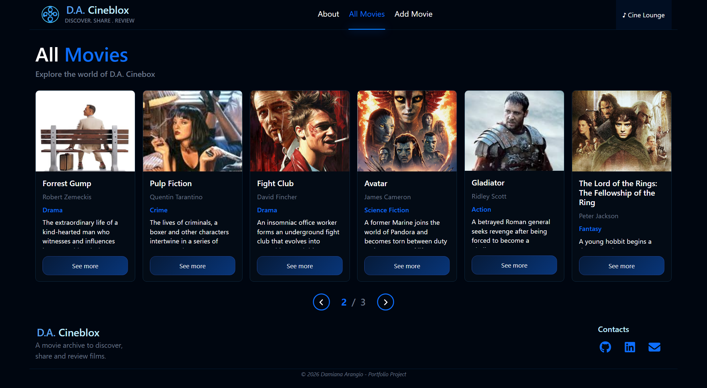
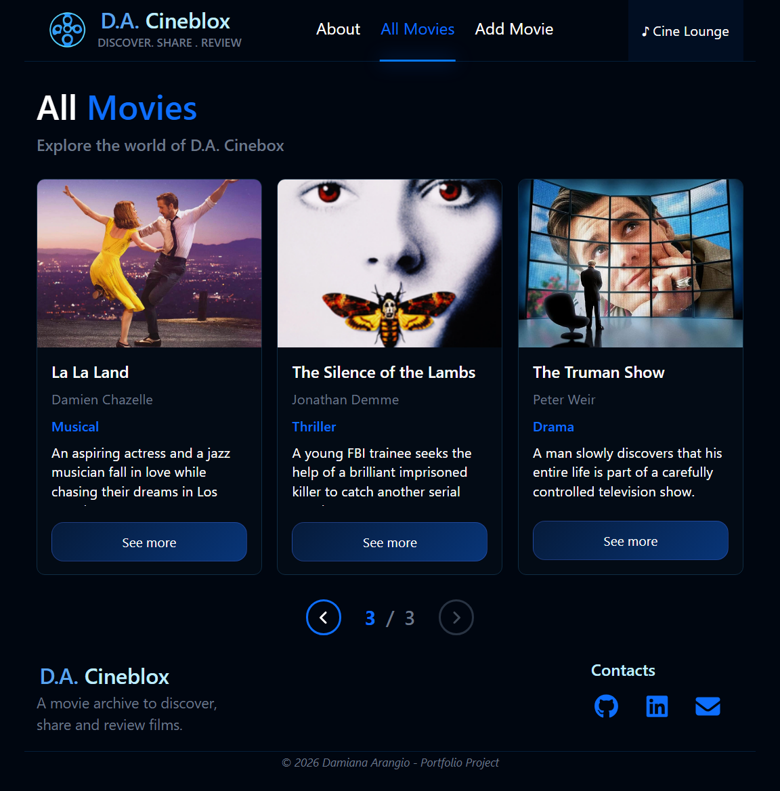
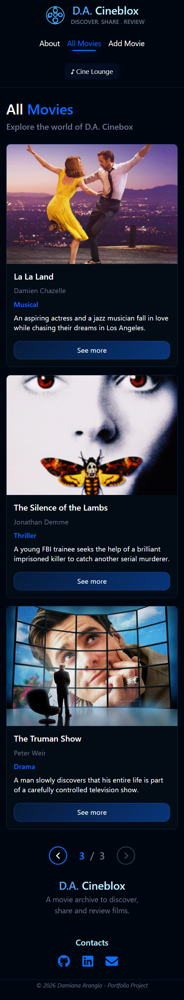

<h1 align="center">🎬 Cineblox - Frontend</h1>

**Cineblox** è una Single Page Application (SPA) full-stack sviluppata con **React**, **Express** e **MySQL** pensata come una piattaforma dedicata al mondo del cinema, dove gli utenti possono consultare film per scoprirne i dettagli, leggere/condividere recensioni e contribuire con nuovi contenuti.

Il frontend comunica con un backend REST tramite chiamate AJAX.

Backend repository:  
[cineblox-backend ](https://github.com/Damiana-Arangio/cineblox-backend)

---

# 🎥 Demo


## Responsive Design

### Movies Page - Desktop


### Movies Page - Tablet


### Movies Page - Smartphone


# Funzionalità principali

- Consultare una pagina introduttiva dell'applicazione
- Visualizzare una lista di film
- Scorrere i film tramite paginazione
- Consultare il dettaglio di un film
- Leggere le recensioni degli utenti
- Inserire una nuova recensione
- Aggiungere un nuovo film con immagine
- Navigare tra le pagine tramite navbar
- Avviare o interrompere la musica

---

# Implementazione frontend

- Context API per gestione loader globale
- Gestione stato locale con Hooks
- Utilizzo di useRef per gestione audio/music player
- Routing dinamico con React Router DOM
- Chiamate HTTP tramite Axios
- Validazione dati lato frontend
- Gestione errori API e pagina 404
- Interfaccia responsive con approccio desktop first 

---

# Architettura applicazione
Lo schema seguente mostra la struttura principale dell'applicazione: il Provider per la gestione del context globale, il layout principale organizzato tramite `Outlet` per il rendering dinamico delle pagine e i principali componenti utilizzati nelle diverse sezioni dell'app.


# Stack

Frontend
- React
- React Router DOM
- Axios
- Context API
- Bootstrap
- CSS

Backend
- Node.js
- Express.js
- Multer
- express-validator

Database
- MySQL

---

# Setup progetto

## 1. Clona il frontend

```bash
git clone https://github.com/Damiana-Arangio/webapp-react.git
cd webapp-react
npm install
npm run dev