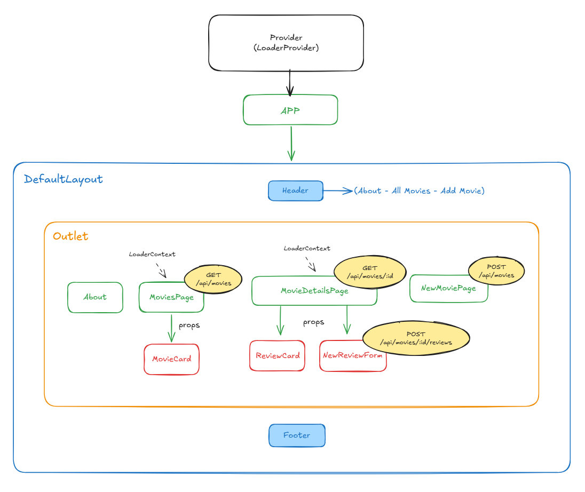

  

<h1 align="center">Web App React</h1>

Frontend di una web application full-stack per la gestione e consultazione di film, sviluppato come Single Page Application con React.

Backend di riferimento:  
https://github.com/Damiana-Arangio/webapp-express.git

---

## Descrizione del progetto

L’applicazione consente di:
- visualizzare una lista di film
- consultare il dettaglio di un singolo film
- leggere e inserire recensioni
- gestire stati di caricamento e navigazione

Il frontend comunica con un backend Express tramite chiamate AJAX ed è strutturato per favorire la riutilizzabilità dei componenti.

---

## Funzionalità principali

- Visualizzazione elenco film
- Pagina di dettaglio con informazioni e recensioni
- Inserimento di nuove recensioni tramite form
- Inserimento di nuovi film
- Gestione del routing con React Router
- Loader globale tramite Context
- Pagina 404 per rotte non valide

---

## Architettura frontend

- Layout condiviso
- Componenti riutilizzabili
- Gestione dello stato locale e globale
- Comunicazione con API REST tramite Axios

---

## Anteprime

### Schema applicazione

### Home Page

### Dettaglio film

### Inserimento nuova recensione

### Inserimento nuovo film

### Pagina 404

---

## Tecnologie utilizzate

- React + Vite
- React Router DOM
- Axios
- Bootstrap / CSS
